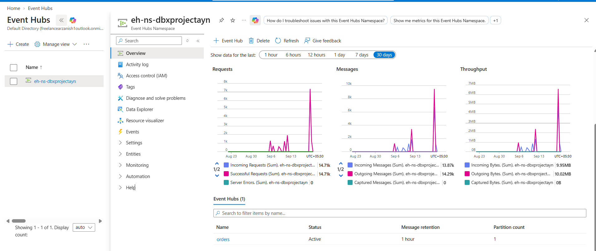
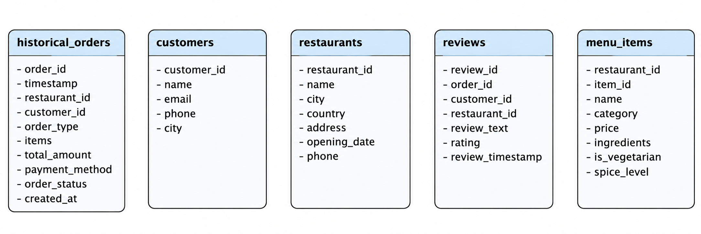
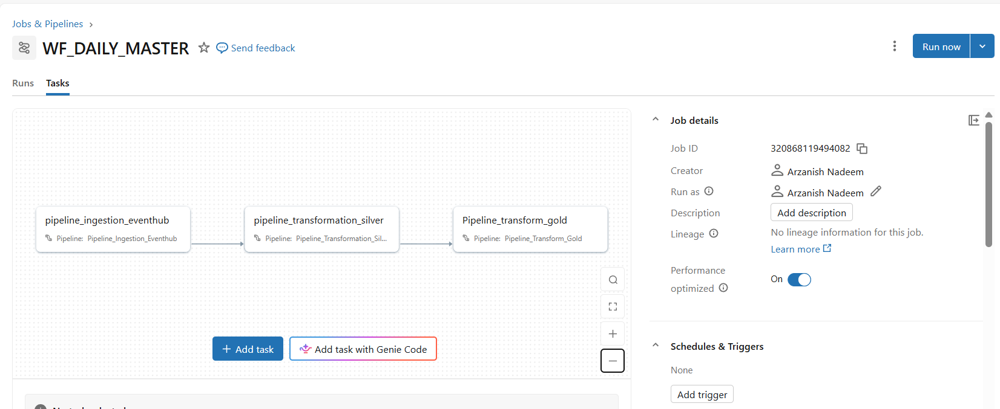
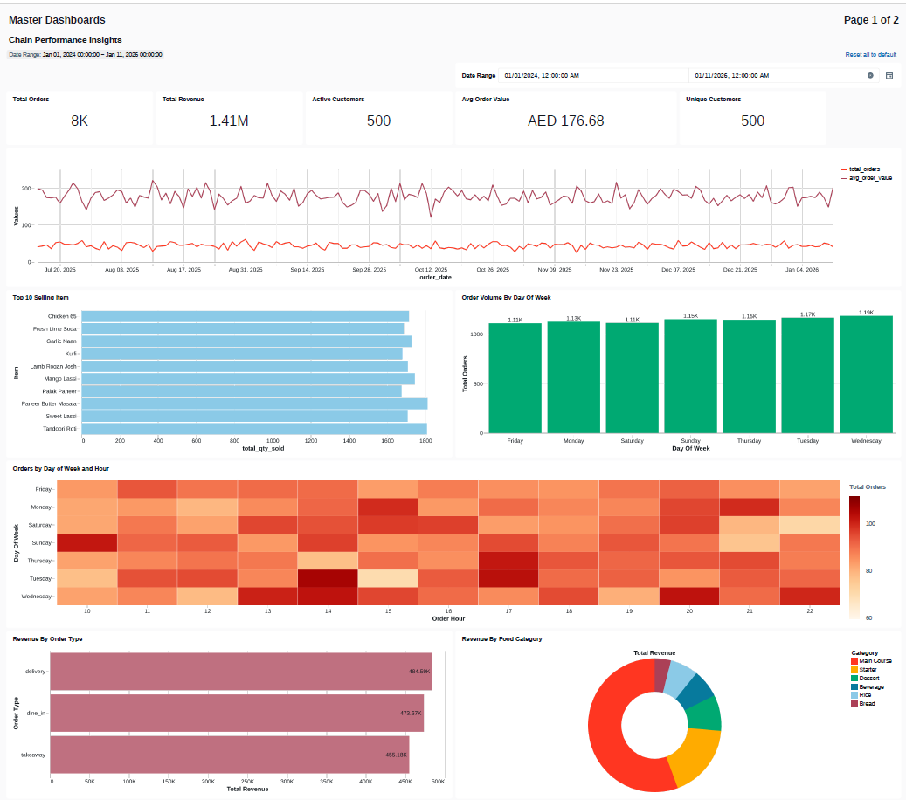
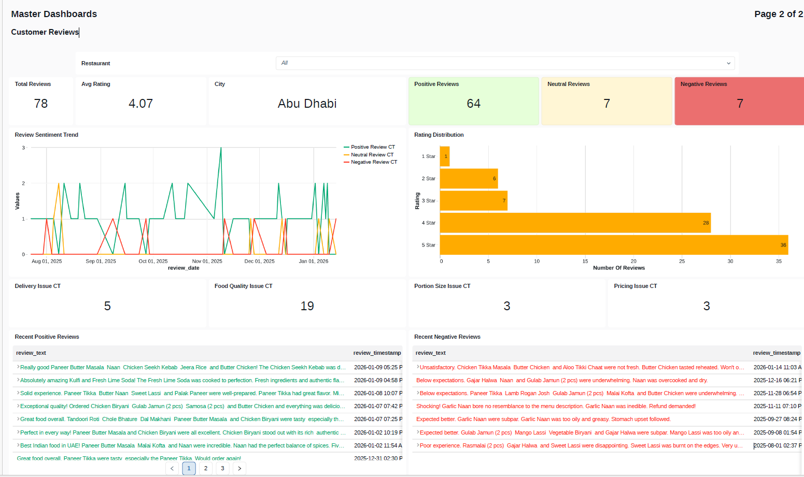

# 🍽️ RestaurantOps

## End-to-End Real-Time Lakehouse Analytics Platform

> An end-to-end Azure Databricks Lakehouse platform built for an Indian restaurant chain operating across five UAE locations.

---

## 📌 Table of Contents

- [Architecture](#-architecture)
- [Business Problem](#-business-problem)
- [Technology Stack](#-technology-stack)
- [Data Sources](#-data-sources)
- [Ingestion Architecture](#-ingestion-architecture)
- [Bronze Layer](#-bronze-layer)
- [Silver Layer](#-silver-layer)
- [Gold Layer](#-gold-layer)
- [Spark Declarative Pipelines](#-spark-declarative-pipelines)
- [CDC with Lakeflow Connect](#-cdc-with-lakeflow-connect)
- [Real-Time Event Streaming](#-real-time-event-streaming)
- [Databricks Workflow](#-databricks-workflow)
- [AI/BI Dashboards](#-aibi-dashboards)
- [Key Engineering Challenges](#-key-engineering-challenges)
- [Project Screenshots](#-project-screenshots)
- [Repository Structure](#-repository-structure)
- [How to Reproduce](#-how-to-reproduce)

---

# 🏗️ Architecture

The platform combines **batch ingestion, CDC ingestion, real-time streaming, Lakehouse transformations, workflow orchestration, and business intelligence**.

```text
                         ┌──────────────────────┐
                         │      Azure SQL       │
                         │                      │
                         │ Customers            │
                         │ Restaurants          │
                         │ Menu Items           │
                         │ Historical Orders    │
                         │ Reviews              │
                         └──────────┬───────────┘
                                    │
                              CDC / Change
                               Tracking
                                    │
                                    ▼
                         ┌──────────────────────┐
                         │  Lakeflow Connect    │
                         │       Gateway        │
                         └──────────┬───────────┘
                                    │
                                    ▼
                         ┌──────────────────────┐
                         │   Unity Catalog      │
                         │    00_landing        │
                         └──────────┬───────────┘
                                    │
                                    ▼
                         ┌──────────────────────┐
                         │    Bronze Layer      │
                         │     01_bronze        │
                         └──────────┬───────────┘
                                    │
                                    │
┌─────────────────────┐             │
│   Order Producer    │             │
│  04_eventhub_orders │             │
└──────────┬──────────┘             │
           │                        │
           ▼                        │
┌─────────────────────┐             │
│   Azure Event Hub   │             │
│       orders        │             │
└──────────┬──────────┘             │
           │                        │
      Kafka Protocol                │
           │                        │
           ▼                        │
┌─────────────────────────────────────────────┐
│        Spark Declarative Pipeline           │
│        Pipeline_Ingestion_Eventhub          │
└──────────────────────┬──────────────────────┘
                       │
                       ▼
                01_bronze.orders
                       │
                       ▼
┌─────────────────────────────────────────────┐
│              Silver Layer                   │
│                 02_silver                   │
│                                             │
│  fact_orders       fact_order_items         │
│  fact_reviews      dim_customers            │
│  dim_restaurants   dim_menu_items           │
└──────────────────────┬──────────────────────┘
                       │
                       ▼
┌─────────────────────────────────────────────┐
│               Gold Layer                    │
│                 03_gold                     │
│                                             │
│  customer_360                               │
│  d_restaurant_reviews                       │
│  d_sales_summary                            │
└──────────────────────┬──────────────────────┘
                       │
                       ▼
             ┌─────────────────────┐
             │ Databricks AI/BI    │
             │     Dashboards      │
             └─────────────────────┘
```

---

# 🎯 Business Problem

The objective of this project is to build a centralized analytics platform for a restaurant chain operating across **five UAE locations**.

The platform supports:

- Real-time order ingestion
- Historical order analysis
- Operational data from Azure SQL
- Change Data Capture (CDC)
- Incremental data processing
- Dimensional data modelling
- Restaurant performance analysis
- Customer analysis
- Review and sentiment analysis
- Interactive business dashboards

The final platform brings together operational, historical, and real-time data into a centralized Lakehouse architecture.

---

# 🛠️ Technology Stack

| Category           | Technology                  |
| ------------------ | --------------------------- |
| Cloud              | Microsoft Azure             |
| Data Platform      | Azure Databricks            |
| Streaming          | Azure Event Hubs            |
| Streaming Protocol | Apache Kafka                |
| Source Database    | Azure SQL Database          |
| CDC                | Lakeflow Connect            |
| Processing         | Apache Spark                |
| Pipeline Framework | Spark Declarative Pipelines |
| Storage            | Delta Lake                  |
| Governance         | Unity Catalog               |
| Orchestration      | Databricks Workflows        |
| Transformation     | PySpark / SQL               |
| Visualization      | Databricks AI/BI Dashboards |
| Development        | Python / SQL                |

---

# 📚 Data Sources

The project uses two primary data sources.

## 1. Azure SQL Database

The Azure SQL database contains:

- `customers`
- `restaurants`
- `menu_items`
- `historical_orders`
- `reviews`

CDC and Change Tracking are enabled on the relevant source tables.

---

## 2. Azure Event Hubs

Real-time order events are generated using:

```text
04_eventhub_orders.py
```

The producer sends order events to the `orders` Event Hub.

Databricks consumes these events through the **Kafka-compatible interface** provided by Azure Event Hubs.

---

# 🔄 Ingestion Architecture

The platform implements multiple ingestion patterns.

## Azure SQL → Lakeflow Connect → Bronze/Silver

```text
Azure SQL
    │
    │ Initial Snapshot + CDC
    ▼
Lakeflow Connect Gateway
    │
    ▼
Unity Catalog Volume
    │
    ▼
Lakeflow Ingestion Pipeline
    │
    ▼
Bronze / Silver
```

## Event Hubs → Spark Structured Streaming → Bronze

```text
Order Producer
      │
      ▼
Azure Event Hubs
      │
      │ Kafka Protocol
      ▼
Spark Structured Streaming
      │
      ▼
Spark Declarative Pipeline
      │
      ▼
01_bronze.orders
```

---

# 🥉 Bronze Layer

The Bronze layer is located in:

```text
01_bronze
```

It contains the raw/initially ingested data.

## SQL Server Ingestion

The following tables are initially ingested:

```text
historical_orders
reviews
```

through:

```text
Pipeline_Ingestion_Bronze
```

---

## Real-Time Orders

Real-time orders are ingested through:

```text
Pipeline_Ingestion_Eventhub
```

The pipeline consumes events from Azure Event Hubs using:

- Kafka protocol
- Spark Structured Streaming
- Spark Declarative Pipelines

The resulting streaming table is:

```text
01_bronze.orders
```

---

## Historical Order Backfill

Historical orders are initially stored in:

```text
01_bronze.historical_orders
```

The historical data is then loaded into:

```text
01_bronze.orders
```

using:

```text
Synthetic_Data/historical_dump.sql
```

This allows historical and real-time orders to be consolidated into a common orders dataset.

---

# 🥈 Silver Layer

The Silver layer is located in:

```text
02_silver
```

The objective of this layer is to transform raw data into reliable, typed, and analytics-ready datasets.

A dimensional data model is created.

## Fact Tables

```text
fact_orders
fact_order_items
fact_reviews
```

## Dimension Tables

```text
dim_customers
dim_restaurants
dim_menu_items
```

### Data Model

```text
                    dim_customers
                         │
                         │
                         ▼
                    fact_orders
                    /    │    \
                   /     │     \
                  ▼      ▼      ▼
       fact_order_items  │  fact_reviews
                         │
                         ▼
                  dim_restaurants
                         │
                         ▼
                   dim_menu_items
```

The model supports relationships such as:

- One order → many order items
- One restaurant → many orders
- One customer → many orders
- One order → one review
- One restaurant → many menu items

---

# 🥇 Gold Layer

The Gold layer is located in:

```text
03_gold
```

This layer contains business-ready datasets used by the analytics layer.

## `customer_360`

Provides a consolidated view of customer-level information and behaviour.

## `d_restaurant_reviews`

Provides restaurant review and sentiment-related analytics.

## `d_sales_summary`

Provides aggregated sales and order metrics for analytical reporting.

The Gold layer uses **Materialized Views** and Databricks' incremental processing capabilities where applicable.

---

# ⚡ Spark Declarative Pipelines

Spark Declarative Pipelines are used throughout the transformation architecture.

The project contains three major ETL pipelines.

## 1. Pipeline_Ingestion_Eventhub

### Purpose

Consume real-time order events from Azure Event Hubs.

### Implementation

```text
eventhub.py
```

Uses:

- Spark Structured Streaming
- Kafka-compatible Event Hubs interface
- Spark Declarative Pipelines

### Output

```text
01_bronze.orders
```

---

## 2. Pipeline_Transformation_Silver

Transforms Bronze data into the Silver dimensional model.

### Transformations

```text
fact_order_items.py
        ↓
02_silver.fact_order_items
```

```text
fact_order.py
        ↓
02_silver.fact_orders
```

```text
fact_reviews.sql
        ↓
02_silver.fact_reviews
```

The Silver layer also contains:

```text
dim_customers
dim_restaurants
dim_menu_items
```

---

## 3. Pipeline_Transform_Gold

Creates business-ready Gold datasets.

### Transformations

```text
d_360.py
        ↓
03_gold.customer_360
```

```text
d_restaurant_reviews.py
        ↓
03_gold.d_restaurant_reviews
```

```text
daily_sale_summary.py
        ↓
03_gold.d_sales_summary
```

---

# 🔁 CDC with Lakeflow Connect

The project uses **Lakeflow Connect** to ingest changes from Azure SQL.

### Initial Load

The ingestion pipeline performs the initial snapshot of the source data.

### Continuous CDC

The Lakeflow Connect Gateway continuously tracks changes from the source database and stages the changes for downstream ingestion.

```text
Azure SQL
    │
    ├── Initial Snapshot
    │
    └── CDC Changes
            │
            ▼
    Lakeflow Connect Gateway
            │
            ▼
    Unity Catalog Volume
            │
            ▼
    Ingestion Pipeline
            │
            ▼
    Databricks Tables
```

This allows changes made in Azure SQL to propagate into the Databricks Lakehouse.

---

# 📡 Real-Time Event Streaming

Real-time orders are generated using:

```text
04_eventhub_orders.py
```

The flow is:

```text
Python Producer
      │
      ▼
Azure Event Hubs
      │
      ▼
Kafka-compatible endpoint
      │
      ▼
Spark Structured Streaming
      │
      ▼
Spark Declarative Pipeline
      │
      ▼
01_bronze.orders
```

The Event Hub uses separate access policies for producer and consumer access:

```text
SEND POLICY
    └── Producer → Event Hub

LISTEN POLICY
    └── Databricks → Event Hub
```

---

# 🗓️ Databricks Workflow

The three ETL pipelines are orchestrated using a Databricks Workflow.

## Workflow

```text
Pipeline_Ingestion_Eventhub
            │
            ▼
Pipeline_Transformation_Silver
            │
            ▼
Pipeline_Transform_Gold
```

The workflow ensures that downstream transformations execute after their upstream dependencies have completed.

---

# 📊 AI/BI Dashboards

The final analytics layer is exposed through two Databricks AI/BI dashboards.

## Dashboard 1 — Restaurant Performance

The dashboard provides insights such as:

- Total Orders
- Total Revenue
- Average Order Value
- Unique Customers
- Daily Sales
- Order Volume by Day of Week
- Peak Order Hours
- Revenue by Order Type
- Revenue by Food Category

Example visualizations include:

- KPI counters
- Sales summaries
- Order trends
- Day/hour heatmaps
- Product performance

---

## Dashboard 2 — Restaurant Review & Sentiment Analysis

The dashboard provides:

- Review Volume Over Time
- Average Rating
- Positive Review Count
- Neutral Review Count
- Negative Review Count
- Sentiment Trends
- Issue Categorization
- Food Quality Issues
- Pricing Issues
- Portion Size Issues
- Recent Reviews

Dashboard filters and parameters allow users to interactively explore the data.

---

# 🧠 Key Engineering Challenges

## 1. Real-Time Streaming

Implemented a real-time ingestion path from:

```text
Azure Event Hubs
        ↓
Kafka
        ↓
Spark Structured Streaming
        ↓
Spark Declarative Pipeline
```

---

## 2. CDC Processing

Implemented CDC ingestion from Azure SQL using:

```text
Lakeflow Connect
```

The solution supports both:

```text
Initial Snapshot
+
Continuous Changes
```

---

## 3. Historical + Real-Time Data

Historical orders were loaded into the same Bronze orders dataset used by the real-time streaming pipeline.

```text
Historical Orders ─────┐
                       ├──> 01_bronze.orders
Real-Time Orders ──────┘
```

This allows downstream Silver and Gold transformations to work against a unified orders dataset.

---

## 4. Incremental Gold Processing

Gold datasets use materialized views and Databricks' incremental processing capabilities where applicable.

Different datasets can have different maintenance strategies depending on the source data and query characteristics.

---

# 📸 Project Screenshots

## Azure Event Hubs



---

## Silver Data Model



---

## Databricks Workflow



---

## Restaurant Performance Dashboard



---

## Review & Sentiment Dashboard



---

# 📁 Repository Structure

```text
RestaurantOps/
│
├── README.md
├── .gitignore
│
├── architecture/
│   ├── architecture.png
│   └── data-model.png
│
├── eventhub/
│   └── 04_eventhub_orders.py
│
├── azure-sql/
│   ├── ddl/
│   │   ├── customers.sql
│   │   ├── restaurants.sql
│   │   ├── menu_items.sql
│   │   ├── historical_orders.sql
│   │   └── reviews.sql
│   │
│   └── cdc/
│       └── utility_script.sql
│
├── pipelines/
│   │
│   ├── eventhub-streaming/
│   │   └── eventhub.py
│   │
│   ├── silver/
│   │   ├── fact_order_items.py
│   │   ├── fact_order.py
│   │   ├── fact_reviews.sql
│   │   ├── dim_customers.py
│   │   ├── dim_restaurants.py
│   │   └── dim_menu_items.py
│   │
│   └── gold/
│       ├── d_360.py
│       ├── d_restaurant_reviews.py
│       └── daily_sale_summary.py
│
├── sql/
│   └── historical_dump.sql
│
├── dashboards/
│   ├── restaurant-performance.png
│   └── review-sentiment.png
│
├── screenshots/
│   ├── eventhub.png
│   ├── lakeflow-connect.png
│   ├── data-model.png
│   └── workflow.png
│
└── docs/
    ├── lakeflow-connect.md
    ├── spark-declarative-pipelines.md
    ├── workflow-orchestration.md
    └── challenges.md
```

---

# 🚀 How to Reproduce

## Prerequisites

You will need:

- Microsoft Azure account
- Azure Event Hubs
- Azure SQL Database
- Azure Databricks workspace
- Unity Catalog enabled
- Databricks CLI
- Python
- Required Databricks permissions

---

## Step 1 — Create Azure Event Hubs

Create:

```text
Event Hub Namespace
        ↓
orders
```

Create two access policies:

```text
SEND POLICY
LISTEN POLICY
```

Use the SEND policy for the producer and the LISTEN policy for Databricks consumption.

---

## Step 2 — Configure Azure SQL

Create the Azure SQL database and execute the DDL scripts located under:

```text
azure-sql/ddl/
```

Load the provided source data.

Then configure Change Tracking and CDC using:

```text
azure-sql/cdc/utility_script.sql
```

---

## Step 3 — Start the Event Producer

Configure the required environment variables:

```text
EVENTHUB_CONNECTION_STRING
EVENTHUB_NAME
```

Then run:

```bash
python eventhub/04_eventhub_orders.py
```

> ⚠️ Never commit connection strings, passwords, access keys, PATs, or other credentials to Git.

---

## Step 4 — Create Databricks Workspace

Create an Azure Databricks workspace and configure Unity Catalog.

Create the following schemas:

```text
00_landing
01_bronze
02_silver
03_gold
```

---

## Step 5 — Configure Lakeflow Connect

Configure the SQL Server connection and Lakeflow Connect ingestion pipelines.

The ingestion flow is:

```text
Azure SQL
    ↓
Lakeflow Connect
    ↓
00_landing
    ↓
01_bronze / 02_silver
```

---

## Step 6 — Run Event Hub Streaming Pipeline

Deploy:

```text
Pipeline_Ingestion_Eventhub
```

This pipeline runs:

```text
eventhub.py
```

and creates:

```text
01_bronze.orders
```

---

## Step 7 — Load Historical Orders

Execute:

```text
sql/historical_dump.sql
```

to merge historical orders into:

```text
01_bronze.orders
```

---

## Step 8 — Run Silver Transformation

Deploy:

```text
Pipeline_Transformation_Silver
```

This creates the Silver dimensional model:

```text
02_silver
│
├── fact_orders
├── fact_order_items
├── fact_reviews
├── dim_customers
├── dim_restaurants
└── dim_menu_items
```

---

## Step 9 — Run Gold Transformation

Deploy:

```text
Pipeline_Transform_Gold
```

This creates:

```text
03_gold
│
├── customer_360
├── d_restaurant_reviews
└── d_sales_summary
```

---

## Step 10 — Orchestrate the Pipelines

Create a Databricks Workflow with the following dependency chain:

```text
Pipeline_Ingestion_Eventhub
            │
            ▼
Pipeline_Transformation_Silver
            │
            ▼
Pipeline_Transform_Gold
```

---

# 🔐 Security

Sensitive credentials should **never** be committed to the repository.

Use:

- Environment variables
- Databricks pipeline parameters
- Secret scopes / secure configuration
- `.gitignore`

Example:

```python
EH_CONN_STR = spark.conf.get("eh-conn-str")
```

Never hard-code:

```python
EH_CONN_STR = "Endpoint=sb://...."
```

---

# 📌 Project Highlights

### Data Engineering

- Real-time event ingestion
- CDC-based ingestion
- Historical data backfill
- Bronze/Silver/Gold architecture
- Dimensional modelling
- Incremental processing

### Databricks

- Spark Declarative Pipelines
- Unity Catalog
- Delta Lake
- Lakeflow Connect
- Databricks Workflows
- AI/BI Dashboards

### Azure

- Azure Event Hubs
- Azure SQL Database
- Azure Databricks

### Analytics

- Restaurant performance
- Sales analysis
- Customer 360
- Review analytics
- Sentiment analysis
- Interactive dashboards

---

# 👨‍💻 Author

**Arzanish Yusuf Nadeem**

Data Engineer | Azure Databricks | PySpark | SQL

---

> ⭐ If you found this project useful, feel free to explore the repository and the implementation details.
